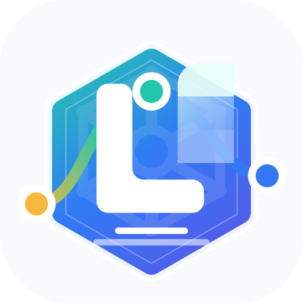

<p align="center">
  
</p>

<h1 align="center">Liteyuki DevOps</h1>

<p align="center">
  面向个人开发者和小团队的 DevOps 应用交付平台。
</p>

<p align="center">
  <a href="docs/01-产品与一体化方案.md">产品方案</a>
  ·
  <a href="docs/03-产品原型.html">产品原型</a>
  ·
  <a href="TODO.md">开发计划</a>
  ·
  <a href="AGENTS.md">开发规范</a>
</p>

## 项目定位

Liteyuki DevOps 将代码仓库、镜像站、构建、部署、网关和域名打通，让开发者只需要维护代码、`Dockerfile` 和少量配置，就能把应用交付成一个可访问的服务。

第一阶段聚焦一条稳定闭环：

```text
绑定仓库
  -> 平台构建镜像
  -> 推送制品库
  -> 部署到 Kubernetes / K3s
  -> 配置 Ingress / Traefik
  -> 分配域名
  -> 展示状态与发布记录
```

## 核心能力

| 模块 | 能力 |
| --- | --- |
| 项目与应用 | 项目空间、应用、成员和权限管理 |
| 认证准入 | 本地账号、OIDC、邀请/导入、准入策略 |
| 代码仓库 | Gitea / GitHub 账号授权、仓库绑定、Webhook |
| 平台构建 | Kubernetes Job + BuildKit rootless 构建镜像 |
| 镜像站 | Harbor / Gitea Registry / DockerHub 接入 |
| 部署发布 | Kubernetes / K3s 部署、Release 记录、回滚 |
| 网关域名 | Ingress / Traefik、自定义域名、HTTP Challenge 证书 |
| 站点配置 | title、logo、favicon、登录页副标题等公开配置 |
| 体验基础 | light / dark / system 主题、i18n、友好错误页 |

## 技术栈

| 领域 | 技术 |
| --- | --- |
| 后端 | Go, Gin, GORM, PostgreSQL, Redis, Asynq, client-go, OpenAPI |
| 前端 | Vite, React, TypeScript, Tailwind CSS, shadcn/ui, TanStack Query |
| 表单与体验 | React Hook Form, Zod, i18next, react-i18next, Sonner |
| 运维与构建 | Docker Compose, Kubernetes Job, BuildKit rootless, Traefik / Ingress |
| Python 工具链 | uv |

## 快速开始

启动开发依赖：

```bash
docker compose -f docker-compose-dev.yaml up -d
```

准备本地环境变量：

```bash
cp .env.example .env.dev
```

启动 API：

```bash
go run ./cmd/api
```

启动 worker：

```bash
go run ./cmd/worker
```

启动前端：

```bash
pnpm --dir web install
pnpm --dir web dev
```

开发环境前端请求 `/api/v1`，由 Vite proxy 反代到 `http://localhost:8080`。

## 容器运行

构建并启动完整平台：

```bash
docker compose up --build
```

访问前端：

```text
http://localhost:8088
```

容器链路：

```text
browser
  -> web nginx :80
  -> /api/* proxy
  -> api :8080
  -> postgres / redis

worker
  -> postgres / redis
```

## 运行模式

| 模式 | 行为 |
| --- | --- |
| `APP_ENV=development` | 启用开发默认管理员，并由后端下发登录页开发账号提示 |
| `APP_ENV=production` | 禁用开发默认管理员；没有平台管理员时需访问 `/bootstrap` 初始化 |
| 未设置 `APP_ENV` | `go run` 按开发模式处理，普通二进制和容器默认按生产模式处理 |

开发模式默认尝试读取 `.env.dev`。也可以通过 `ENV_FILE` 指定其它本地 `.env.*`：

```bash
ENV_FILE=.env.local go run ./cmd/api
ENV_FILE=.env.local go run ./cmd/worker
```

生产环境必须配置稳定的 `SECRET_ENCRYPTION_KEY`，用于加密后台直接填写的 OIDC/Git Client Secret。

## 目录地图

```text
cmd/api                 API 服务入口
cmd/worker              异步任务 worker 入口
internal/               后端领域模块、配置、模型和 API
migrations/             PostgreSQL 数据库迁移
openapi/                OpenAPI 定义
web/                    Vite + React 前端
web/public/             静态资源，包含 SVG logo / favicon
docs/                   产品、原型、AI 能力和品牌说明
```

## 品牌资产

- 主 Logo / Favicon：[`web/public/liteyuki-logo.svg`](web/public/liteyuki-logo.svg)
- Mascot：[`web/public/brand/mascot-liteyuki-devops.png`](web/public/brand/mascot-liteyuki-devops.png)
- 品牌说明：[`docs/05-品牌与Logo.md`](docs/05-品牌与Logo.md)

前端默认公开配置、favicon 和 README 都引用同一个 SVG 源文件；后台仍可通过站点配置覆盖 `site.logoUrl` 和 `site.faviconUrl`。

## 文档

推荐阅读顺序：

1. [产品与一体化方案](docs/01-产品与一体化方案.md)
2. [产品原型](docs/03-产品原型.html)
3. [AI 能力提案](docs/04-AI能力提案.md)
4. [品牌与 Logo](docs/05-品牌与Logo.md)
5. [TODO](TODO.md)
6. [AI 开发规范](AGENTS.md)

## 开发约定

- 前端必须使用 `pnpm`。
- Python 必须使用 `uv`。
- Go 后端使用 `Gin + GORM`。
- 平台构建主路径使用 `Kubernetes Job + BuildKit rootless`。
- Gitea/GitHub Actions 仅作为可选 BuildProvider。
- 部署由平台统一执行和记录。
- 前端所有用户可见文本必须走 i18n，不在组件中硬编码文案。
